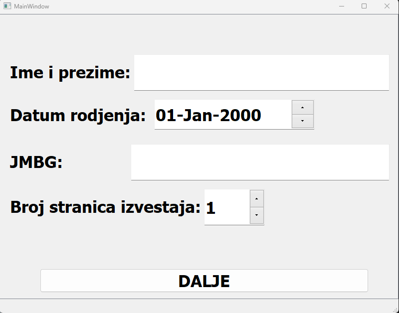

# My Python App for Medical Reports

This small Python app is designed to generate doctor's reports as PDFs. It was created for a family member to help with organizing medical documentation.

## How to Use

1. **Set up the app**: Make sure you have the required dependencies installed.
2. **Configure the app**: Update the `config.json` file to set up necessary configurations before running the app.
3. **Run the app**: Use the GUI to enter patient information, diagnosis details, and generate the PDF report.

## Screenshots

Here are some screenshots of the application:

### Screenshot 1


### Screenshot 2


## Sample PDF Report

You can download a sample PDF report generated by the app:

[Download Sample PDF Report](Patient_Patientich_20241021.pdf)

## Configuration

Before running the app, ensure that you populate the `config.json` file with necessary information, such as:
```json
{
    "header": [

    ],
    "footer": [

    ]
}
